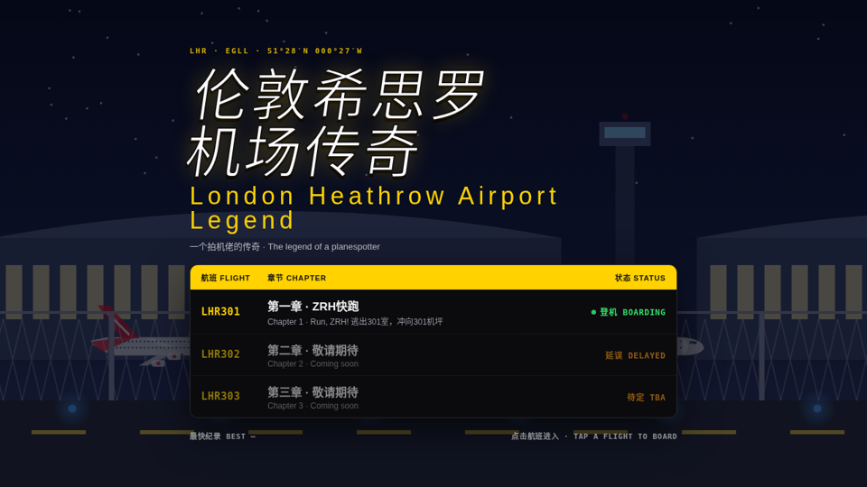
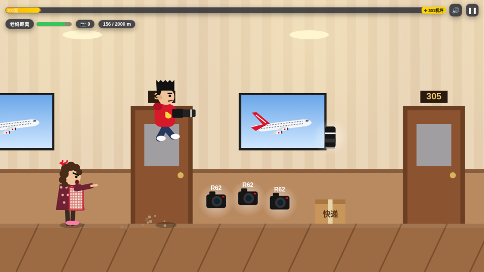
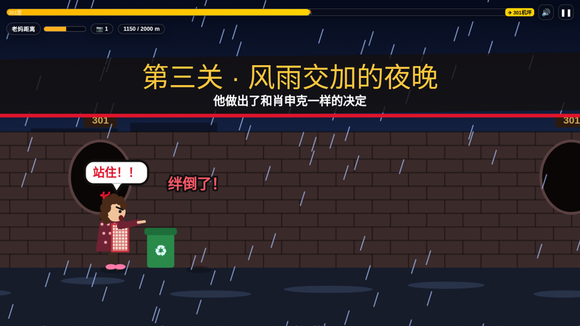
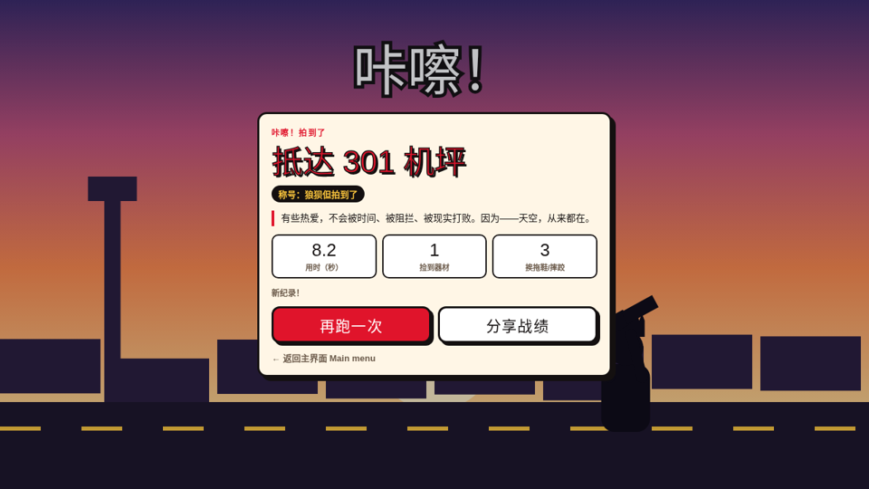
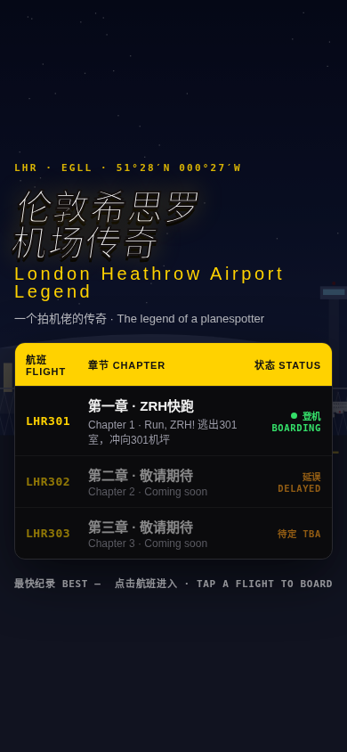

# 伦敦希思罗机场传奇
### London Heathrow Airport Legend

**一个拍机佬的传奇 · The legend of a planespotter**

**🎮 游戏地址 / Play here：https://hanhaoxuan114514-glitch.github.io/LHR-GAME/**

---

## 📖 故事 Story

> 妈妈：**不准拍！再拍就别想出门！整天拍飞机有什么用！**
> ZRH：**我要拍飞机！！！**

今晚，那架印着「我为 R62+RF100400 代言」涂装的 A380 就要从 **301 机坪** 起飞。
带上你的 R62 和 100-400，冲出 301 室，穿过小区、风雨夜和机场围栏，别被老妈和她的飞拖鞋逮住。

*Tonight, the A380 wearing your very own "R62 + RF100-400" livery departs from Stand 301. Grab your camera, escape Room 301, and outrun Mum and her flying slippers.*

---

## ✈️ 章节 Chapters

| 航班 Flight | 章节 Chapter | 状态 Status |
|:--|:--|:--|
| **LHR301** | 第一章 · ZRH快跑 / *Run, ZRH!* | 🟢 已上线 Boarding |
| LHR302 | 第二章 · 敬请期待 / *Coming soon* | 🟠 延误 Delayed |
| LHR303 | 第三章 · 敬请期待 / *Coming soon* | ⚪ 待定 TBA |

### 第一章 · ZRH快跑

横版跑酷，全程 **2000 米**，四个关卡：

| | 关卡 Stage | |
|:--:|:--|:--|
| 1 | 逃出 301 室 *Escape Room 301* | 快递箱、拖把桶、晾衣架 |
| 2 | 小区夜跑 *Evening run* | 共享单车、路障、限高杆 |
| 3 | 风雨交加的夜晚 *A stormy night* | 他做出了和肖申克一样的决定 |
| 4 | 翻进机场 *Into the airport* | 行李车、指示牌，终点 301 机坪 |

---

## 🕹️ 操作 Controls

| 动作 Action | 电脑 Desktop | 手机 Mobile |
|:--|:--|:--|
| 跳跃 Jump（空中再按可二段跳） | `空格` / `↑` / `W` | 点屏幕 **右侧** |
| 滑铲 Slide | `↓` / `S` | 点屏幕 **左侧** |
| 暂停 Pause | `P` / `Esc` | 右上角 ❚❚ |

## 🎒 道具与机制 Items & Mechanics

- 📷 **R62 / 100-400 镜头**：拉开和老妈的距离 *(push Mum back)*
- ⭐ **金色 Z9**：「尼康 Z9 是对的！」无敌冲刺 3 秒 *(3s invincible dash)*
- 🩴 **飞拖鞋**：老妈出手前会提示「跳!」或「滑!」 *(watch for the warning)*
- 💢 **老妈距离条**：撞到障碍她就追近一截，追上即被抓回 301

通关后按用时和失误次数评定称号：**传奇拍机佬** / 资深拍机佬 / 狼狈但拍到了 / 浑身拖鞋印的追梦人

---

## 🛠️ 技术 Tech

- 单文件 `index.html`：原生 HTML + CSS + Canvas 2D，无任何依赖、无需构建
- 自适应横屏 / 竖屏，支持键盘、鼠标与触屏
- WebAudio 合成音效，本地保存最快纪录
- 部署于 GitHub Pages

*Single-file vanilla HTML/CSS/Canvas game — no build, no dependencies.*

## 📅 更新日志 Changelog

- **v1.0**（2026-09-28）
  - 主界面「伦敦希思罗机场传奇」，航班信息屏风格
  - 第一章《ZRH快跑》：4 个关卡、道具、飞拖鞋、通关结局与称号
  - 电脑 + 手机适配

---

*有些热爱，不会被时间、被阻拦、被现实打败。因为——天空，从来都在。*

**持续更新中 · To be continued…**

